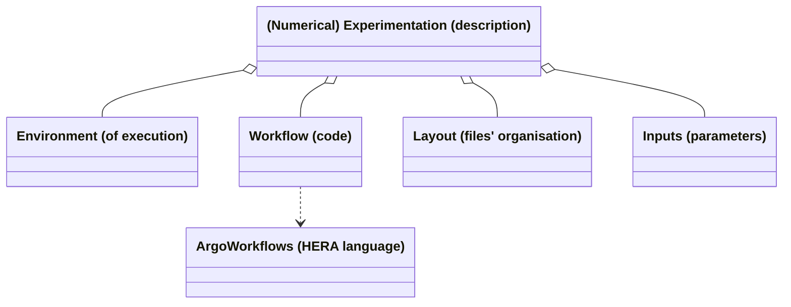
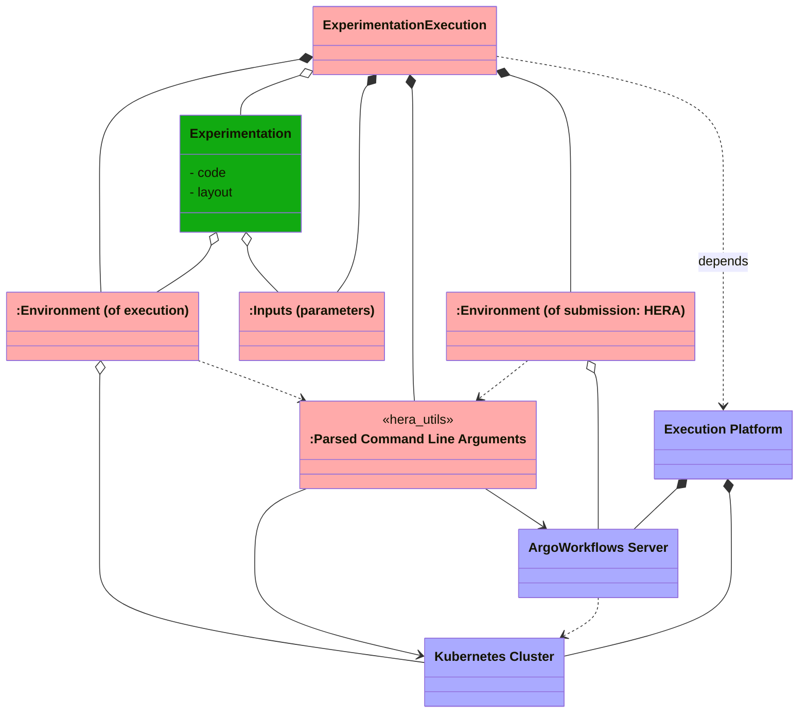

# hera_utils: an embryonic python library of Hera workflows utilities

`hera_utils` is a python package gathering helpers

- facilitating the abstraction/separation of [Hera (workflows)](https://github.com/argoproj-labs/hera) based scripts from the concrete servers that shall be used to running them,
- proposing a simple/direct organizational structure of numerical experiments scripts based on [Hera (workflows)](https://github.com/argoproj-labs/hera).

The purpose of `hera_utils` boils down to a comment of the following diagrams



The description of a (numerical) experimentation (more generaly of a job) may be structured on top of the following separated concerns

- the expression of the specific atomic computations (tasks) that should be realized and their possible organization within a [**computational workflow**](https://en.wikipedia.org/wiki/Scientific_workflow_system) e.g. [Hera](https://github.com/argoproj-labs/hera)
- the experiment **inputs**: what concrete set of parameters should be used
- the experiment **layout** (naming convention, organisational structure) of its inputs/outputs: where (in which file, directory, database...) does each task take its (file) inputs from and where does that task store its outputs to (and how does it name them)
- the (execution) environment required for its execution e.g. the workflow engine that shall be used: in this ArgoWorkflows biased context, some concrete **ArgoWorflows server**

Once given the description of an experimentation, you will will proceed to execute it (run the workflow with the help of an ArgoWorkflows engine running on some execution platform).
It is the role of the Experimentation Execution to construct the instances required by the Experimentation to be properly executed:



## The big lines of what hera_utils helps you to set up

```python
import hera_utils

# Make sure that all the elements of the HERA context can be extracted from either
# the Command Line Arguments (CLI) or environment variables:
args = hera_utils.parse_arguments()      

# Assert that the k8s cluster (designated by the CLI arguments) is accessible:
cluster = hera_utils.k8s_cluster(args)

# Assert that the ArgoWorkflows server (designated by the CLI arguments), and running
# on the cluster, is accessible:
argo_server = hera_utils.argo_server(cluster, args)

# Eventually transmit to the Hera workflow the environment/context that it expects
# (the argo server, an associated access token, the ad-hoc namespace...): 
argo_server.define_argo_server_part_of_environment()
```

You can now proceed with the dependencies of an experimentation, that is its environment, input and layout

```python

from environment import numerical_experiment_environment
environment = numerical_experiment_environment(cluster, args)
from my_specific_input import inputs
from my_experiment_layout import layout
layout_instance = layout(inputs.constants)

# Eventually define the workflow code with the Hera library and on top
# of environment, input and layout
...
```

## A more complete example

The above code snippet were volutarily sketchy in order to provide some understanding of what is done.The following example slightly improves on the usage of `hera_utils` by encapsulating things (hiding technical details): refer to the [`numerical_experiment_environment::construct_environment(args)` method within `examples/environment.py`](./examples/environment.py) for some clues on how this is done.

Additionnaly the following code provides more detailed comments

```python
if __name__ == "__main__":
    from hera_utils import parse_arguments
    # Retrieve the parsed CLI arguments and environment variables (of the python script)
    # that designates (and provides access to e.g. through credentials):
    #   1. `k8s_cluster`: an accessible Kubernetes cluster
    #   2. `argo_server`: an ArgoWorkflows server (running on the above k8s cluster)
    # Hera will this `argo_server` to submit the workflows (that is on which the following 
    # workflow with be executed):
    args = parse_arguments()

    from environment import construct_environment
    # The environment might also depend on CLI argument and/on environment variables in
    # order for the numertical experiment to retrieve e.g. 
    # - k8s volume claims (for its inputs/outputs)
    # - k8s config maps used to retrieve cluster specific information (HTTP proxy...)
    environment = construct_environment(args)

    # Import the inputs (aka parameters) of this numerical experiment
    from my_specific_input import inputs

    # Define the numerical experiment input/output file layout (directory hierarchy, 
    # filenames for each task...)
    from my_experiment_layout import layout
    layout_instance = layout(inputs.constants)

    # Proceed with the definition of the workflow that is solely based on the above
    # defined abstractions/encapsulations that is the
    # - environment (what must be changed when the k8s cluster changes)
    # - inputs (what must be changed when the numerical experiment changes: its parameters)
    # - layout (how the numerical experiment names its input/output (files, generated
    #   container) and organizes them (directory structure)
    # This is the part where hera.workflows is used to define the task:
    from hera.workflows import DAG, Task, Workflow
    with Workflow(generate_name="do-some-stuff-", entrypoint="dag") as w:
        with DAG(name="dag"):
            # Definition of some tasks and containers
            dummy_fanin_t = print_script(name="print-results")
            collect_c = collect_container_constructor(
                environment,      # Used e.g. to access the container registry
                inputs.constants, # Used e.g. to select/name the ad-hoc container
            )
            
            # Loop on the numerical experiment parameters
            for vintage in inputs.parameters.vintages:
                # The result directory depends both on
                #  - a k8s volume claim pertaining to the environment
                #  - an organisational choice encapsulated in the layout class
                #    (and pametrized with the inpjut)
                results_dir = os.path.join(
                    environment.persisted_volume.mount_path,
                    layout.collect_output_dir(vintage)
                )
                collect_t = Task(
                    name="collect-" + layout.container_name_postend(vintage),
                    template=collect_c,
                    arguments={
                        "vintage": vintage,
                        "results_dir": results_dir,
                    },
                    with_items=inputs.parameters.boroughs,
                )
                # Use Hera syntax to hookup the tasks in a workflow
                collect_t >> dummy_fanin_t
    w.create()
```

## Installation

```bash
python -m pip install git+https://github.com/VCityTeam/ExpeData-Workflows_testing/tree/master/ArgoWorkflows/Workflows_In_Hera/hera_utils
```

and uninstalling goes

```bash
python -m pip uninstall -y hera_utils        # No confirmation asked
```

Quick importation check

```bash
python -c "import hera_utils"
```

## For developers

## Setting up the development context

```bash
git clone https://github.com/VCityTeam/ExpeData-Workflows_testing.git
cd ArgoWorkflows/Workflows_In_Hera/hera_utils
python3.10 -m venv venv
 . venv/bin/activate
pip install -r requirements.txt      # Installs hera_utils
```
