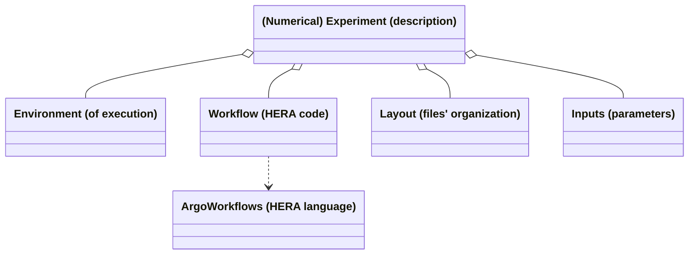
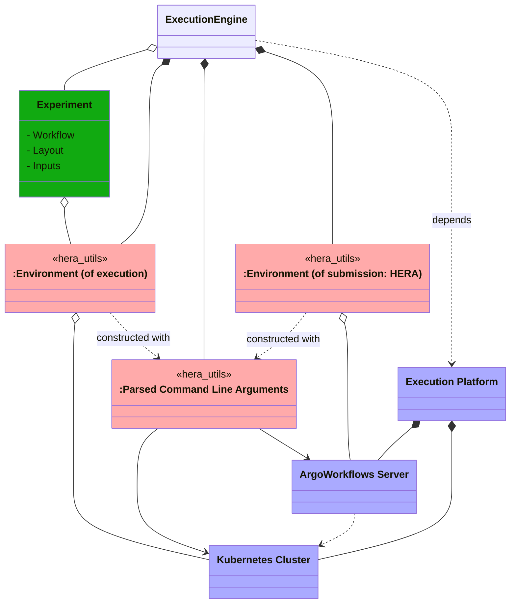
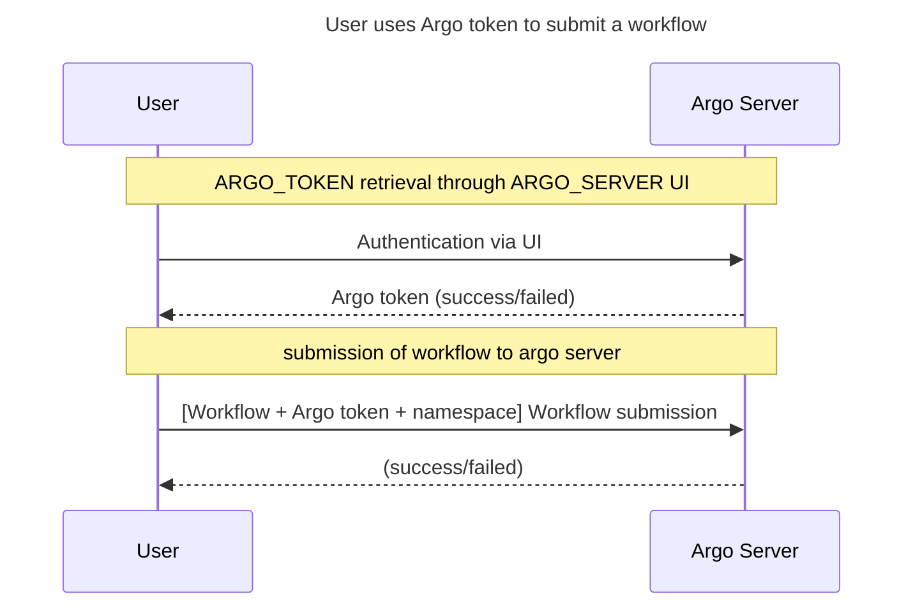
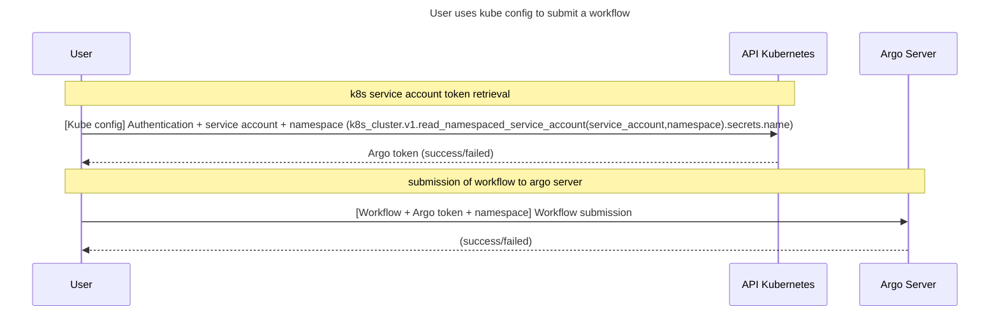
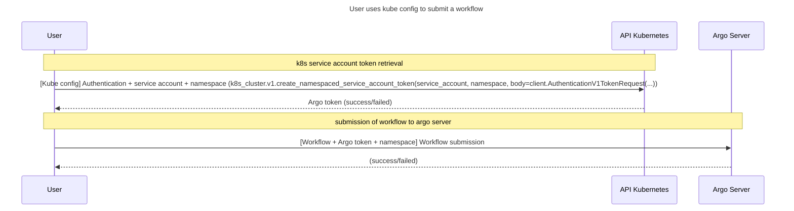
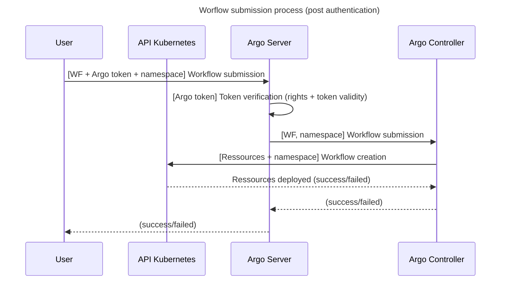

# hera_utils: an embryonic python library of Hera workflows utilities<!-- omit from toc -->

## Table of contents<!-- omit from toc -->

- [Introduction](#introduction)
- [What `hera_utils` should help you set up: a functional description](#what-hera_utils-should-help-you-set-up-a-functional-description)
- [A more complete example](#a-more-complete-example)
- [Configuring access to the Kubernetes and Argo servers](#configuring-access-to-the-kubernetes-and-argo-servers)
    - [Retrieve your Kubernetes cluster credentials (for CLI usage)](#retrieve-your-kubernetes-cluster-credentials-for-cli-usage)
    - [Retrieve your Argo Server credentials (for CLI usage)](#retrieve-your-argo-server-credentials-for-cli-usage)
    - [Choosing a mode of persistence for your servers' environment variables](#choosing-a-mode-of-persistence-for-your-servers-environment-variables)
    - [hera\_utils configuration through environment variables](#hera_utils-configuration-through-environment-variables)
    - [hera\_utils configuration through a configuration file](#hera_utils-configuration-through-a-configuration-file)
- [`hera_utils` package installation](#hera_utils-package-installation)
- [Assert the installation/configuration by running the tests/examples](#assert-the-installationconfiguration-by-running-the-testsexamples)
- [For developers](#for-developers)
    - [Setting up the development context](#setting-up-the-development-context)
    - [Design](#design)

## Introduction

`hera_utils` is a Python package gathering helpers

- facilitating the abstraction/separation of [Hera-based workflows](https://github.com/argoproj-labs/hera) based scripts from the concrete servers that shall be used to run them,
- proposing a simple/direct organizational structure of numerical experiments scripts based on [Hera (workflows)](https://github.com/argoproj-labs/hera).

The purpose of `hera_utils` boils down to a comment of the following diagrams



The description of a (numerical) experiment (more generally a set of jobs) may be structured on top of the following separated concerns:
- the expression of the specific atomic computations (tasks) that should be realized and their possible organization within a [**computational workflow**](https://en.wikipedia.org/wiki/Scientific_workflow_system) e.g. [Hera](https://github.com/argoproj-labs/hera)
- the experiment **inputs**: what concrete set of parameters should be used
- the experiment **layout** (naming convention, organizational structure) of its inputs/outputs: where (in which file, directory, database...) does each task take its (file) inputs from and where does that task store its outputs to (and how does it name them)
- the (execution) environment that is the set of resources required for the execution of the experiment e.g. a [persistent volume](https://kubernetes.io/docs/concepts/storage/persistent-volumes/), a container registry...

Once given (the description of) an Experiment, one uses an `execution engine` in order to proceed with its realization. When executing an Experiment, the ArgoWorkflows engine (say a Python interpreter) will

1. [provision](https://en.wikipedia.org/wiki/Provisioning) a concrete instance of the Environment (of execution),
2. launch the computations (most often) by delegating/submitting it to Workflow to some ArgoWorkflows server. The set of information required for that submission is gathered within an Environment of submission.

The execution engine will thus need to hold the following data model



The objects depicted with the `<<hera_utils>>` [(UML) stereotype](https://www.uml-diagrams.org/stereotype.html) are susceptible to benefit from the `hera_utils` package.

## What `hera_utils` should help you set up: a functional description

```python
import hera_utils

# Make sure that all the elements of the HERA context can be extracted from either
# the Command Line Arguments (CLI) or the environment variables:
args = hera_utils.parse_arguments()      

# Assert that the k8s cluster (designated by the CLI arguments) is accessible:
cluster = hera_utils.k8s_cluster(args)

# Assert that the ArgoWorkflows server (also designated by the CLI arguments and running
# on the above cluster), is accessible:
argo_server = hera_utils.argo_server(cluster, args)

# Eventually transmit to the Hera workflow the environment of submission that it expects
# (the argo server, an associated access token, the ad-hoc namespace...): 
argo_server.define_argo_server_part_of_environment()
```

Your Python script (more precisely, your Experiment expressed as a Python script) can now proceed with expressing its dependencies, that is its environment (of execution), input and layout

```python
from environment import numerical_experiment_environment
environment = numerical_experiment_environment(cluster, args)
from my_specific_input import inputs
from my_experiment_layout import experiment_layout
layout = experiment_layout(inputs.constants)
```

Eventually define the workflow code with the Hera library and on top of the environment, input and layout variables

```python
define_hera_workflow(environment, input, layout)   # Based-on/uses hera.workflows
```

## A more complete example

The above code snippets were voluntarily sketchy/abstract in order to simplify the understanding of the functional logic of a (Hera-based) Experiment.
The following example slightly improves on the usage of `hera_utils` by hiding technical functional details under the hood: refer to the [`numerical_experiment_environment::construct_environment(args)` method within `examples/environment.py`](./examples/environment.py) for some clues on how this encapsulation is realized.

Additionally, the following code also provides more detailed comments

```python
if __name__ == "__main__":
        from hera_utils import parse_arguments
        # Retrieve the parsed CLI arguments and environment variables (of the Python script)
        # that designate (and provide access to e.g. through credentials):
        #   1. a `k8s_cluster`: an accessible Kubernetes cluster
        #   2. an `argo_server`: an ArgoWorkflows server (running on the above k8s cluster)
        # Hera (when interpreted with Python) will use this `argo_server` to submit the workflow 
        # (that is the server on which the following workflow will be executed):
        args = parse_arguments()

        from environment import construct_environment
        # The environment might also depend on the CLI argument and/or environment variables in
        # order for the numerical experiment to retrieve e.g. 
        # - some k8s volume claims (for its inputs/outputs)
        # - k8s config maps used to retrieve cluster-specific information (HTTP proxy...)
        # The construct_environment() function encapsulates/hides 
        # - the usage of the k8s_cluster to provision the Experiment execution environment
        # - the construction of the Hera (library) submission environment
        environment = construct_environment(args)

        # Import the inputs (aka parameters) of this numerical experiment
        from my_specific_input import inputs

        #
    # filenames for each task...)
    from my_experiment_layout import experiment_layout
    layout = layout(inputs.constants)

    # Proceed with the definition of the workflow that is solely based on the above
    # defined abstractions/encapsulations that is the
    # - environment (what must be changed when the k8s cluster changes)
    # - inputs (what must be changed when the numerical experiment changes: its parameters)
    # - layout (how the numerical experiment names its input/output (files, generated
    #   container) and organizes them (directory structure)
    # This is the part where hera.workflows library is used in order to define the tasks/workflow.
    # The following workflow definition restricts its inputs to the following variables:
    # - environment, 
    # - input, 
    # - layout
    from hera.workflows import DAG, Task, Workflow
    with Workflow(generate_name="do-some-stuff-", entrypoint="dag") as w:
        with DAG(name="dag"):
            # Definition of some tasks and containers
            dummy_fan_in_t = print_script(name="print-results")
            collect_c = collect_container_constructor(
                environment,      # Used e.g. to access the container registry
                inputs.constants, # Used e.g. to select/name the ad-hoc container
            )
            
            # Loop on the numerical experiment parameters
            for vintage in inputs.parameters.vintages:
                # The result directory depends both on
                #  - a k8s volume claim pertaining to the environment
                #  - an organizational choice encapsulated in the layout class
                #    (and parametrized with the input)
                results_dir = os.path.join(
                    environment.persisted_volume.mount_path,
                    layout.collect_output_dir(vintage)
                )
                collect_t = Task(
                    name="collect-" + layout.container_name_post_end(vintage),
                    template=collect_c,
                    arguments={
                        "vintage": vintage,
                        "results_dir": results_dir,
                    },
                    with_items=inputs.parameters.boroughs,
                )
                # Use Hera syntax to hookup the tasks in a workflow
                collect_t >> dummy_fan_in_t
    w.create()
```

## Configuring the access to the Kubernetes and Argo servers

The execution of a given Hera workflow requires

- the mandatory knowledge of an Argo Server that shall be used by (Python using) Hera to submit the considered workflow,
- the optional knowledge of the underlying Kubernetes cluster when the considered workflow requires some cluster resources (e.g. some persisted volume that the workflow must use for its file based input/output).

Note: the existence of Kubernetes cluster is mandatory since it is a requirement for the existence of the Argo Server. What is optional is the workflow knowledge of that cluster: the workflow execution might indeed not require any precondition that should be asserted at Kubernetes cluster level.

In the following documentation we assume the considered workflow requires access to both the Kubernetes and the Argo server.

### Retrieve your Kurbenetes cluster credentials (for CLI usage)

The designation (and means of access to) a Kubernetes cluster is done through [a kubeconfig file and an associated KUBECONFIG environment variable](https://kubernetes.io/docs/concepts/configuration/organize-cluster-access-kubeconfig/).

`Kubeconfig` files can be [exported from an existing clusters](https://stackoverflow.com/questions/61829214/how-to-export-kubeconfig-file-from-existing-cluster).
For example, if you Kubernetes cluster is handled by a rancher server, then the cluster `kubeconfig` file can be retrieved [through rancher's web UI](https://ranchermanager.docs.rancher.com/how-to-guides/new-user-guides/manage-clusters/access-clusters/use-kubectl-and-kubeconfig).

Once you retrieved the ad-hoc `kubeconfig` file, that you renamed e.g. `my_cluster_kubeconfig.yaml`, assert that `kubectl` can now access the cluster with e.g. the commands

```bash
export KUBECONFIG=`pwd`/my_cluster_kubeconfig.yaml   # Make it an absolute path
kubectl get nodes                                    # or e.g. "kubectl get pods"
```

### Retrieve your Argo Server credentials (for CLI usage)

In analogy with the retrieval of a Kubernetes Cluster credentials, the retrieval of your Argo Server credentials (for CLI level access) can be done through the Argo Server web-UI.

The credentials of the Argo server of the PAGoDA platform must also be retrieved
through the UI of the Argo server of the PAGoDA platform.
For this web browse to <https://argowf.pagoda.os.univ-lyon1.fr/> and use
the `Single Sign ON` login mode to provide your LIRIS lab credentials (just as
for the Kubernetes cluster credential, these credentials are the ones defined
in LIRIS'
[ldap](https://en.wikipedia.org/wiki/Lightweight_Directory_Access_Protocol)
server).

Once authenticated on your Argo Server Web UI

- select the `User` Tab within the left icon bar,
- within the `Using Your Login With The CLI` section of the `User` page use the `Copy to clipboard` button to retrieve your credentials (in the form of a set of environment variables e.g. `ARGO_SERVER`),
- trigger a shell and define those environment variables within that shell (paste the commands held in the "clipboard"),
- if not already done, install [argo CLI](https://github.com/argoproj/argo-workflows/releases/),
- assert that you can access your Argo Server with `argo CLI` e.g. with the commands
  
  ```bash
  argo list
  ```

### Choosing a mode of persistence for you servers environment variables

`hera_utils` offers two concrete means (that can be combined) for configuring the servers that an Hera workflow scripts will need to access to:

- by using environment variables: this assumes that it is the responsibility of the user to persist the required environment variables (most often within a [shell script](https://en.wikipedia.org/wiki/Shell_script) e.g. [this argo.bash script](./examples/argo.bash.tmpl)),
- an ad-hoc `hera_utils` configuration file (e.g. [this hera.config file](./examples/hera.config.tmpl)).

The two following chapters respectively present the two above way of things.

### hera_utils configuration through environment variables

The above mentioned environment variables, `KUBECONFIG`, `ARGO_SERVER`, `ARGO_NAMESPACE` can be persisted with some shell script file e.g. your [shell](https://en.wikipedia.org/wiki/Unix_shell) rc [(run command)](https://en.wikipedia.org/wiki/RUNCOM) e.g. your `~/.bash_login` or `~/.bashrc` file or some local file.For example you might rename [the `argo.bash.tmpl` script](./examples/argo.bash.tmpl) to e.g. `argo.bash` and customize it.
This script can then be imported into your current active shell

- either with the `export $(grep -v '^#' argo.bash | xargs)` command
- or by defining a function (in your `~/.bashrc` or `~/.bash_aliases`) of the
  form

  ```bash
  importenv() {
  set -a
  source "$1"
  set +a
  }
  ```
  
  and invoking the `importenv argo.bash` command from your current active shell.

### hera_utils configuration through a configuration file

For this `hera_utils` configuration mode, rename the [this hera.config file](./examples/hera.config.tmpl) and customize for your cluster, argo server and with your credentials.

## `hera_utils` package installation

You might wish to use a [(python) virtual environment](https://packaging.python.org/en/latest/guides/installing-using-pip-and-virtual-environments/) and activate it e.g. with

```bash
python3.10 -m venv venv
$ source venv/bin/activate
(venv)
```

The proceed with the `hera_utils` package installation

```bash
python -m pip install git+https://github.com/VCityTeam/hera_utils
```

and uninstalling goes

```bash
python -m pip uninstall -y hera_utils        # No confirmation asked
```

In order to quickly check the installation use

```bash
python -c "import hera_utils"
```

## Assert the installation/configuration by running the tests/examples

Look for the various test and examples within the [examples subdirectory](./examples/Readme.md).

## For developers

### Setting up the development context

```bash
git clone https://github.com/VCityTeam/hera_utils.git
cd hera_utils
python3.10 -m venv venv
 . venv/bin/activate
pip install -r .      # Installs local version
```

### Design

HERA utils: A python class that defines some HERA utils that are commonly used in the experiments  
Layout: Used for defining the input/output layout of the application


## Using Hera utils to submit a workflow

As recalled by the [Hera authentication documentation](https://hera.readthedocs.io/en/stable/walk-through/authentication/)
`the way you authenticate generally depends on your unique organization setup.`

### Argo server (direct) authentication handling

In this authentication setup, the user has to know and provide an `ARGO_SERVER` token.
For this the user might retrieve his `ARGO_SERVER` token through the ARGO UI.
The corresponding authentication sequence diagram goes



### Authentication through a k8s service account's token secret (requires k8s authentication)

Notes:
- A service account token and `ARGO_TOKEN` are of different nature since they do _not_ provide access to the same service. 
  A service account token seem to provide access to the argo-server at the k8s level.
  Whereas an `ARGO_TOKEN` provides access to the Argo Server API.
  Both tokens also different by their format (an `ARGO_TOKEN` is prefixed with the `Bearer v2:` string)
- This method is [not recommended since Kubernetes version 1.24](https://kubernetes.io/docs/concepts/security/service-accounts/#get-a-token)
  and token creation became restricted to manual mode starting from Kubernetes version 1.27.
In this authentication mode the `ARGO_TOKEN` is setup by the cluster admin and stored as a secret within a k8s service account. 
It is the user's responsibility to retrieve this token through the usage of k8s API which imposes k8s access/authentication
(basically a `KUBECONFIG` file).
The sequence diagram is very similiar to the above one except for the first stage of token retrieval.



References: for an Hera example refer to [this k8s_api.py example](https://github.com/argoproj-labs/hera/blob/39f685a382cfa9f2ce2a8c77657960748502fbe6/examples/k8s_sa.py#L39C9-L39C43).


### Generating an Argo Token out of a k8s service account (requires k8s authentication)

In this authentication mode the user asks the k8s cluster to generated an `ARGO_TOKEN`. 
Again, the usage of k8s API imposes k8s access/authentication (basically a `KUBECONFIG` file).
The sequence diagram is almost identical to the above one except for the method used within the k8s API.




https://argo-workflows.readthedocs.io/en/latest/managed-namespace/

### Notes concerning ArgoServer vs ArgoController vs KubeAPI

The sequence diagram goes




### K8s Prerequisites

- Retrieve a KUBECONFIG file
- Retrieve a kubernetes **namespace** on which the user (associated to your KUBECONFIG file) has the rights of usage.
- Retrieve the Argo server URL 

Note: if k8s cluster admin chose to use Rancher, to create a projet and to create an associated namespace (within the project), then your admin might have chose to grant rights to that namespace by using [role bindings](https://kubernetes.io/docs/reference/access-authn-authz/rbac/).

### Working on Argo
- Ask the administrators to grant you access to the Argo service by providing your project and namespace

From this point, you are now authorized and autonomous to submit your workflows on Argo.

#### Submitting a workflow
##### Using the kubeconfig file
- Download the kubeconfig file of your cluster from Rancher

INFO: The kubeconfig file is a configuration file that contains authentication information for accessing a Kubernetes cluster.
It is used by the kubectl command-line tool to communicate with the cluster.
It grants you the rights to perform any actions within your namespace.

##### Using the Argo token
Warning: the Argo token might not give you the access to the cluster. It is used to submit workflows on the Argo server.
You may not to be able to check some information about the cluster.

- Read the [Argo Workflows manual](https://argo-workflows.readthedocs.io/en/stable/quick-start/)
