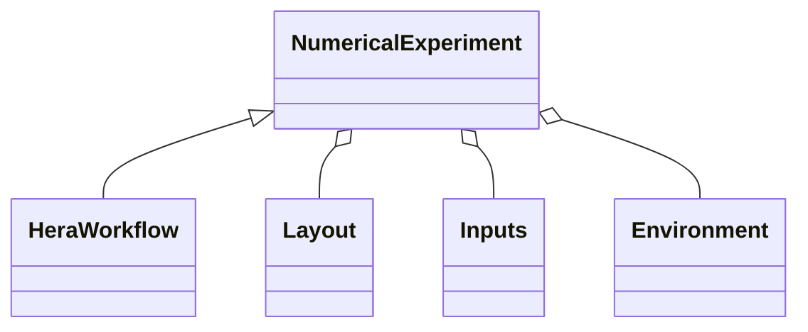

# hera_utils usage examples



```python
if __name__ == "__main__":
    from hera_utils import parse_arguments
    # Retrieve the parsed CLI arguments and environment variables (of the python script)
    # that designates (and provides access to e.g. through credentials):
    #   1. `k8s_cluster`: an accessible Kubernetes cluster
    #   2. `argo_server`: an ArgoWorkflows server (running on the above k8s cluster)
    # Hera will this `argo_server` to submit the workflows (that is on which the following 
    # workflow with be executed):
    args = parse_arguments()

    from environment import construct_environment
    # The environment might also depend on CLI argument and/on environment variables in
    # order for the numertical experiment to retrieve e.g. 
    # - k8s volume claims (for its inputs/outputs)
    # - k8s config maps used to retrieve cluster specific information (HTTP proxy...)
    environment = construct_environment(args)

    # Import the inputs (aka parameters) of this numerical experiment
    from my_specific_input import inputs

    # Define the numerical experiment input/output file layout (directory hierarchy, 
    # filenames for each task...)
    from my_experiment_layout import layout
    layout_instance = layout(inputs.constants)

    # Proceed with the definition of the workflow that is solely based on the above
    # defined abstractions/encapsulations:
    # - environment (what must be changed when the k8s cluster changes)
    # - inputs (what must be changed when the numerical experiment changes: its parameters)
    # - layout (how the numerical experiment names its input/output (files, generated
    #   container) and organizes them (directory structure)
    from hera.workflows import DAG, Task, Workflow
    with Workflow(generate_name="do-some-stuff-", entrypoint="dag") as w:
        with DAG(name="dag"):
            # Definition of some tasks and containers
            dummy_fanin_t = print_script(name="print-results")
            collect_c = collect_container_constructor(
                environment,      # Used e.g. to access the container registry
                inputs.constants, # Used e.g. to select/name the ad-hoc container
            )
            
            # Loop on the numerical experiment parameters
            for vintage in inputs.parameters.vintages:
                # The result directory depends both on
                #  - a k8s volume claim pertaining to the environment
                #  - an organisational choice encapsulated in the layout class
                #    (and pametrized with the inpjut)
                results_dir = os.path.join(
                    environment.persisted_volume.mount_path,
                    layout.collect_output_dir(vintage)
                )
                collect_t = Task(
                    name="collect-" + layout.container_name_postend(vintage),
                    template=collect_c,
                    arguments={
                        "vintage": vintage,
                        "results_dir": results_dir,
                    },
                    with_items=inputs.parameters.boroughs,
                )
                # Use Hera syntax to hookup the tasks in a workflow
                collect_t >> dummy_fanin_t
    w.create()
```

## TODO

- illustrate how to run the hello_world_container example
- provide an example retrieving the http proxy and asserting its effectiveness
  (introduces the docker subdirecoty, and illustrating the local k8s container
  registry usage)
